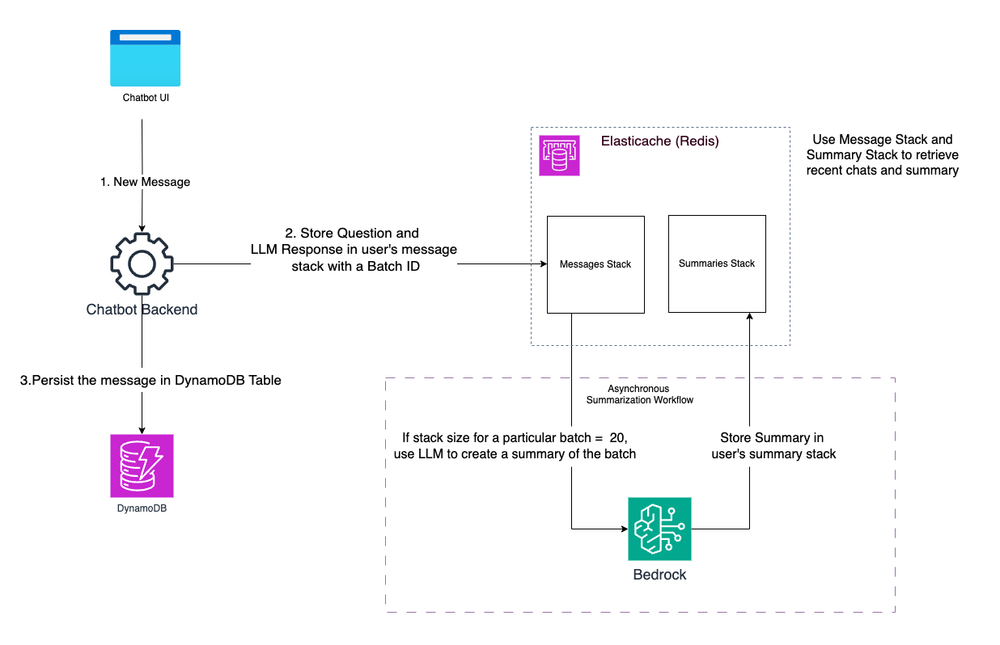

## Managing Chat History and Context at scale in Generative AI Chatbots

#### **Introduction:**
--------------------------
Generative AI chatbots are transforming customer engagement across industries by providing instant support, tailored recommendations, and seamless interactions. They excel in diverse use cases like automating helpdesk support, guiding users through onboarding, and answering queries with personalized responses. One of the critical aspects of effective chatbot interactions is the ability to maintain conversation context. By recalling previous interactions, chatbots can respond in a relevant and coherent manner, creating a more engaging experience.

One way to provide this context is by passing the chat history directly to the large language model (LLM). However, as chat history grows with continued user interaction, several challenges arise. The LLM’s token limit restricts how much data can be processed at once, making it challenging to convey complete conversation context in a concise manner. Additionally, managing the growing chat history efficiently becomes a significant data management problem.

In this post, we present a pattern that leverages a hybrid architecture combining Redis for in-memory storage and DynamoDB for persistent, scalable storage. This solution also uses a summarization algorithm that aggregates batches of messages to ensure concise context is passed to the LLM.

#### **The Problem:**
--------------------------
1. Maintaining Accurate Conversation Context:
    - Users expect chatbots to understand previous interactions and provide relevant, personalized responses. Without efficient access to chat history, responses can become disjointed and impersonal.
2. Token Limit Constraints of LLMs:
    - LLMs have a maximum input token limit, restricting how much context they can consider at once.
    - Directly passing large chat histories to an LLM can exceed this limit, leading to incomplete context or errors.
3. Relevance vs. Redundancy:
    - Passing too much data to the LLM can introduce noise, reducing response quality.
    - Including redundant information overwhelms the LLM and consumes valuable tokens.
4. Scalable Data Management:
    - The chat system must handle growing volumes of messages while ensuring each message is quickly stored and queried.
    - Summarizing chat data is essential for balancing storage costs with efficient retrieval.

#### **The Solution**
---------------------------
The solution involves three key components that work together to ensure chat history is stored, summarized, and queried efficiently:

1. **In-Memory Chat History Storage (Redis):**
   - **Purpose:** Provides immediate access to recent chat messages, reducing latency during live conversations.
   - **Structure:** Messages are stored in user-specific Redis stacks, organized by batch for fast retrieval and summarization.
   - **Advantage:** Offers high-speed reads/writes, serving as a buffer before data is persisted to DynamoDB.

2. **Persistent Chat History Storage (DynamoDB):**
   - **Purpose:** Ensures reliable and scalable storage of all historical chat data.
   - **Structure:** Uses a Global Secondary Index (GSI) to efficiently query messages based on `UserId` and `Timestamp`.
   - **Advantage:** Enables consistent long-term storage and retrieval, allowing access to complete historical data.

3. **Summarization Logic:**
   - **Purpose:** Aggregates every 20 messages into a summary to provide concise conversation context.
   - **Batch Summaries:** Summaries contain essential details that are more relevant than passing all messages individually to the LLM.
   - **Advantage:** Provides a compact overview of conversations, reducing input size for LLMs while maintaining relevant historical context.

#### **Algorithm Explanation:**
--------------------------------

1. **New Message Workflow:**
- When a new chat message arrives, it is marked with a unique batch identifier, and a timestamp is added.
- The message is then stored in the Redis stack (an in-memory cache) for quick access and in the DynamoDB table for long-term storage.
- The system checks how many messages are in the current batch.
- If 20 messages are reached:
    - A separate background process starts to summarize them.
    - The batch identifier is incremented so new messages can start forming a new batch.

2. **Summary Creation Workflow:**
- In the background, the system retrieves the 20 messages for the current batch from Redis.
- It aggregates these messages into a summary containing essential information about the conversation.
- The summary is added to Redis for quick retrieval and persisted in DynamoDB for long-term storage.
- The original 20 messages are removed from Redis to save memory.

3. **Reloading Cache Workflow:**
- If the application restarts or the in-memory cache is reset, the system reloads the most recent 20 messages or summaries from DynamoDB.
- This chat history is populated into Redis, ensuring that chatbots can access recent conversations.

#### **Data Model**
--------------------------
**Redis:**
-   Stack Keys: Chat messages are organized into individual stacks per user, using the pattern {user_id}:stack.
-   Summary Keys: Each user also has summary entries with the key pattern {user_id}:summary for batch summaries.

**DynamoDB:**
- Partition Key (UserId): Messages are grouped by user for efficient retrieval.
- Sort Key (Timestamp): Messages are ordered chronologically within each user’s partition

#### Sample Data
-----------------------------
#### Redis (In-Memory)

**Messages (Stacks per User):**

| Stack Key          | Message Batch | Timestamp               | Content                                  |
|--------------------|---------------|-------------------------|-------------------------------------------|
| user123:stack      | Batch 1       | 2024-05-01T10:00:00Z    | Hello, how are you?                      |
| user123:stack      | Batch 1       | 2024-05-01T10:01:00Z    | I'm doing well, thank you!               |
| user123:stack      | Batch 2       | 2024-05-01T10:10:00Z    | Can you provide an update on my order?   |
| user456:stack      | Batch 1       | 2024-05-01T10:15:00Z    | Hi there, I'd like to learn more         |
| user456:stack      | Batch 1       | 2024-05-01T10:16:00Z    | What information would you like?         |
| user456:stack      | Batch 2       | 2024-05-01T10:25:00Z    | Can you assist me with billing queries?  |

**Summaries:**

| Summary Key        | Batch ID | Count | Timestamp               | Summary                                 |
|--------------------|----------|-------|-------------------------|------------------------------------------|
| user123:summary    | Batch 1  | 20    | 2024-05-01T10:05:00Z    | A quick summary of the first 20 messages|
| user456:summary    | Batch 1  | 20    | 2024-05-01T10:20:00Z    | Here's a summary of the last 20 messages|

#### DynamoDB (Persistent Storage)

| UserId   | Timestamp               | Content                                  | BatchId | Count |
|----------|-------------------------|-------------------------------------------|---------|-------|
| user123  | 2024-05-01T10:00:00Z    | Hello, how are you?                      | 1       |       |
| user123  | 2024-05-01T10:01:00Z    | I'm doing well, thank you!               | 1       |       |
| user123  | 2024-05-01T10:05:00Z    | A quick summary of the first 20 messages | 1       | 20    |
| user123  | 2024-05-01T10:10:00Z    | Can you provide an update on my order?   | 2       |       |
| user456  | 2024-05-01T10:15:00Z    | Hi there, I'd like to learn more         | 1       |       |
| user456  | 2024-05-01T10:16:00Z    | What information would you like?         | 1       |       |
| user456  | 2024-05-01T10:20:00Z    | Here's a summary of the last 20 messages | 1       | 20    |
| user456  | 2024-05-01T10:25:00Z    | Can you assist me with billing queries?  | 2       |       |

  

This approach ensures that chat history remains relevant, concise, and easy to query, ultimately enabling chatbots to deliver high-quality, context-aware responses.

Please see sample.ipynb for code.